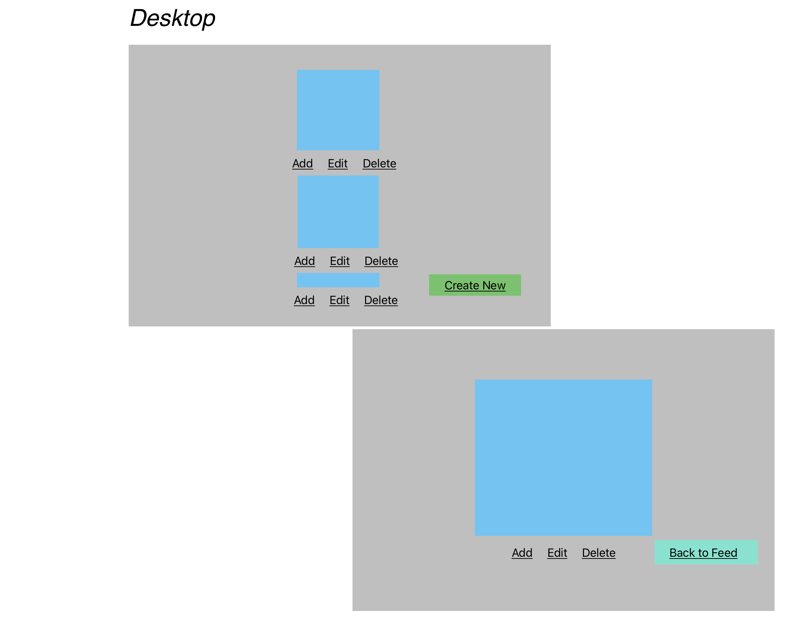
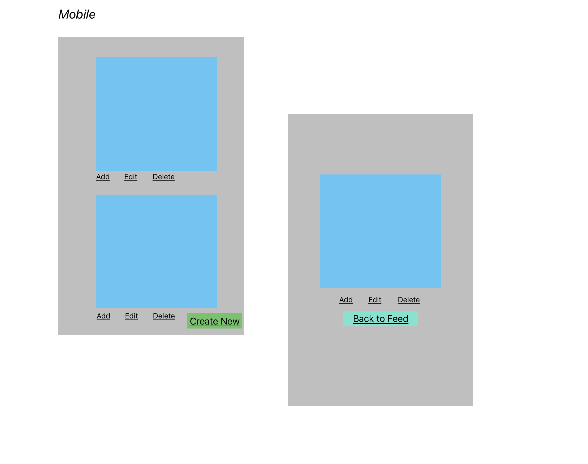
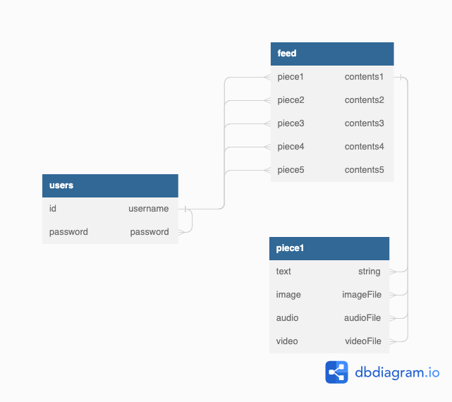

# PROJECT 2

- **Project Name:** Bizarre
- **Project By:** Nicholas Smith
- [**LINK TO GITHUB:**](https://github.com/nicholasjamessmith/bizarre)
- [**LINK TO DEPLOYED WEBSITE**](https://bizarre.onrender.com/)
- **List of technologies used: ** HTML, CSS, JS, NODE, EXPRESS, EJS, Mongo
- [**LINK TO TRELLO**](https://trello.com/b/mhPIIh41/project2)

## Description
Bizarre is a model version of a multimedia blog site. The scope of the site will depend on how many features can be realistically deployed within the time allotted for the project. At the very least, the site will be a functional journaling platform with the ability to create, read, update, and delete journal entries. Ideally, the site will feature audio, images, text, and video.

Users should be able to view a list of exisiting data on the site (either just text or multimedia), and interact with this data by adding text to it, viewing individual elements, deleting elements, and editing/updating elements. If the app is built with authentication, users should be able to add elements from the model feed to their user page.

Data will be stored, retrieved from, added to, and deleted from the Mongo Database site connected via Mongoose ODM library.

Ideally, the data model for each type of post would be a "piece", and each piece would include some text, image, audio, or video, or a combination of those elements.

The site will be built designed with RESTful routes architecture using JavaScript and HTML, using Node and Express frameworks, EJS templating, and styled using CSS.

##Mockup of UI
-Desktop View 
-Mobile View 

##List of Backend Endpoints

| Endpoint         | Method | Purpose                                                          |
| ---------------- | ------ | ---------------------------------------------------------------- |
| /pieces          | GET    | list all pieces                                                  |
| /pieces/new      | GET    | display 'new' page (form)                                        |
| /pieces          | POST   | create new piece                                                 |
| /pieces/:id      | GET    | display individual show page of a piece                          |
| /pieces/:id      | DELETE | delete current piece                                             |
| /pieces/:id/edit | GET    | display edit page (form)                                         |
| /pieces/:id      | PUT    | edit/update individual piece and redirects to list of all pieces |
| */mypieces       | GET    | display list of all user's pieces                                |
| */pieces/:id     | POST   | adds piece to /mypieces page                                     |

*optional (depending on if built with authentication, and if model feed idea is realistic)

##ERD (Entity Relationship Diagram)
