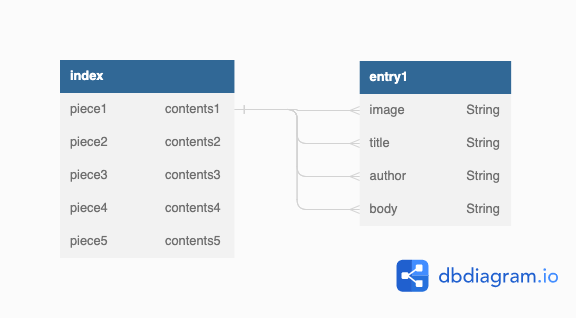

# PROJECT 2

- **Project Name:** Simple Journal
- **Project By:** Nicholas Smith
- [**LINK TO GITHUB:**](https://github.com/nicholasjamessmith/bizarre)
- [**LINK TO DEPLOYED WEBSITE**](https://bizarre.onrender.com/)
- **List of technologies used: ** HTML, CSS, JS, NODE, EXPRESS, EJS, Mongo
- [**LINK TO TRELLO**](https://trello.com/b/mhPIIh41/project2)

## Description
Simple Journal is a journaling platform with the ability to create, read, update, and delete journal entries. Users should be able to view a list of exisiting entries on the site (either just text or multimedia), and interact with this data by adding text to it, viewing individual entries, deleting entries, and editing/updating entries. If there is time, the app may be built with authentication, allowing users to store data in separate accounts.

Data will be stored, retrieved from, added to, and deleted from the Mongo Database site connected via Mongoose ODM library.

The data model for each type of post will be an "entry", and each entry would include an author, a title, body text, and possibly an image.

The site will be built designed with RESTful routes architecture using JavaScript and HTML, using Node and Express frameworks, EJS templating, and styled using CSS.

##Mockup of UI
-Desktop View 
-Mobile View 

##List of Backend Endpoints

| Endpoint          | Method | Purpose                                                          |
| ----------------- | ------ | ---------------------------------------------------------------- |
| /entries          | GET    | list all e ntries                                                |
| /entries/new      | GET    | display 'new' page (form)                                        |
| /entries          | POST   | create new entry                                                 |
| /entries/:id      | GET    | display individual show page of an entry                         |
| /entries/:id      | DELETE | delete current entry                                             |
| /entries/:id/edit | GET    | display edit page (form)                                         |
| /entries/:id      | PUT    | edit/update individual entry and redirects to list of all pieces |

##ERD (Entity Relationship Diagram)
